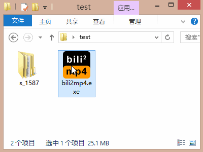

# bili2mp4  
将bilibili安卓客户端的离线缓存转换为mp4  
基于 python3.5+ 和 ffmpeg 实现  

# 下载地址
本项目只提供windows版本的独立可执行程序，下载地址在此---->[点我!](https://github.com/bitdust/bili2mp4/releases)

# 使用方法  
1. 在bilibili安卓客户端离线你所要的视频  
2. 连接手机和电脑，进入手机的 `Android\data\tv.danmaku.bili\download` 目录
3. 这个目录中的每一个文件夹都对应着一个离线视频，可以根据修改日期找到您刚离线的视频文件夹
4. 将文件夹复制到您的电脑中
5. 将复制出来的文件夹拖放到`bili2mp4.exe`图标上
6. 稍等片刻，当前目录中会生成一个`bili2mp4_output`文件夹，转换后的视频就会输出到这里
7. 一同输出的还包括xml弹幕文件，推荐使用<弹弹play>播放器播放视频和弹幕.

# 使用演示


# 打包&进阶使用
## 可以在linux下使用吗？
我尽力把代码写的跨平台了，但并没有测试。您可以试试在linux下安装ffmpeg后，直接使用纯python脚本方式运行。
## 如何使用纯python脚本执行？
也许你在使用linux或者并不想使用打包的exe，那么可以直接使用python运行本脚本:  
```
python bili2mp4.py <视频文件夹>
```
当然，需要python3.5以上运行环境，同样依赖ffmpeg，请下载ffmepg到本脚本同级目录或安装ffmpeg到系统PATH中即可。
## 如何打包为单独可执行文件？
本项目依赖 ffmpeg 工具，因此需要下载 ffmpeg 到项目根目录;  
然后使用pyinstaller打包即可输出exe文件，打包命令为:
```
pyinstaller -F bili2mp4.spec
```
exe文件保存在dist目录下。
## 为什么用安卓客户端下载视频？是电脑不能上网还是手机话费太多了？  
那就问问这个世界为什么会这么操蛋吧~  
